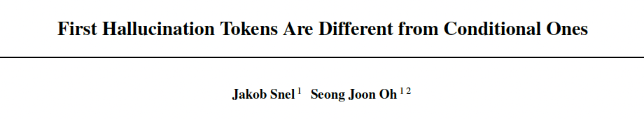

[](paste_arxiv_link_here)

<h2 align="center">First Hallucination Tokens Are Different From Conditional Ones</h2>

<p align="center">
  
  <br><br>
  
</p>

This repository includes the code to reproduce the internal states for the RAGTruth dataset as well as detectability and separability scores that uncover positional differences between hallucination tokens of different indices described in our paper 'First Hallucination Tokens Are Different From Conditional Ones'.

> **Abstract**:
Hallucination, the generation of untruthful content, is one of the major concerns regarding foundational models. Detecting hallucinations at the token level is vital for real-time filtering and targeted correction, yet the variation of hallucination signals within token sequences is not fully understood. Leveraging the RAGTruth corpus with token-level annotations and reproduced logits, we analyse how these signals depend on a tokens position within hallucinated spans, contributing to an improved understanding of token-level hallucination. Our results show that the first hallucinated token carries a stronger signal and is more detectable than conditional tokens. We release our analysis framework, along with code for logit reproduction and metric computation.

This repository provides:
* **Core Scripts**:
  * `rtx/create_dataset.py`: Enriches the RAGTruth dataset with logits and hidden states and restructures it for analysis.
  * `rtx/analyse_hallucination.py`: Analyses hallucinations using token- and sequence-level uncertxinty scores.
  * `rtx/visualise_hallucination.py`: Visualises hallucination patterns in model outputs.
  * `rtx/utils.py`: Contains utility functions for data processing and analysis.
  * `rtx/config.py`: Configuration file with paths and settings.


* **Data and Results**:
  * `dataset/`: Contains the RAGTruth dataset and enriched datasets with logits and hidden states.
  * `visualisation/`: Contains generated plots and visualisations.
  * `results/`: Stores analysis results for different models and positional contexts.
  * `plots/`: Plotted analysis results for different models and positional contexts.

## Reproducing the Experiments
This section documents how to reproduce the experiments in our paper.

### Setup
First, install the requirements

```
conda create --name rtx python=3.12
conda activate rtx
pip install -r requirements.txt
pip install -e .
```

### Reproduce Logits (& Hidden States)

You can run the reproduction of model outputs for llama-2-7b-chat, llama-2-13b-chat, llama-2-70b-chat, and mistral-7B-instruct:

```
python rtx/create_dataset.py --input_dir dataset/RAGTruth/ --save_dir dataset/rtx --add_logits
```
To also reproduce the hidden states, set the according flag: ```--add_hidden_states```.
This script will group the RAGTruth annotations model-wise and reproduce logits and hidden states if the respective flag is set. The resulting dataset structure is as follows:

```bash
dataset/
├── rtx/
│ ├── mistral-7B-instruct/
│ │   ├── mistral-7B-instruct.json      ← Token/sequence-level AUROC and metrics
│ │   └──outputs
│ │     └── <source_id>/                ← One directory per RAGTruth sample
│ │      ├── hidden_states/             ← Token-level hidden states (usually one file per layer)
│ │      └── logits.pt                  ← Token logits tensor
│ ├── llama-2-7b-chat/
│ │   ├── llama-2-7b-chat.json          
│ │   └──outputs
│ │     └── <source_id>/                
│ │      ├── hidden_states/             
│ │      └── logits.pt                  
│ ├── llama-2-13b-chat/
│ │   ├── llama-2-13b-chat.json
│ │   └──outputs
│ │     └── <source_id>/
│ │      ├── hidden_states/
│ │      └── logits.pt
│ └── llama-2-70b-chat/
│     ├── llama-2-70b-chat.json
│     └──outputs
│       └── <source_id>/
│        ├── hidden_states/
│        └── logits.pt
└── RAGTruth/                           ← Original RAGtruth dataset
   ├── response.jsonl                   ← Annotated responses with hallucination spans 
   └── source_info.jsonl                ← related metadata
```

### Run Detectability and Separability Analysis

You can reproduce our analysis of token-level logits with:

```
python rtx/analyse_hallucination.py --output_dir results/ --dataset_dir dataset/rtx/ --sequence_scopes all first second third+
```

Furthermore, you can configure the following analysis parameters:

* ```--sample_size_threshold``` to modify the sample size threshold set for detectability and separability score computation, below which no scores are computed
* ```--model_name``` to only analyse a specific models logits
* ```--sample_ids``` to only compute the analysis for specific RAGTruth samples of a given model

This script creates a model-wise set of results per metric. For each detectability signal, the resulting json file is structured as follows: 
Comment: This also includes hallucination span-level analysis that is not considered in the paper.

```
<metric>
├── llama-2-7b-chat
│   ├── sequence                                       ← global sequence-level AUROC
│   │   ├── all_vs_non                                 ← global hallucinated (all spans) vs non-hallucinated
│   │   ├── first_sequence_vs_non                      ← global hallucinated first-span tokens vs non-hallucinated
│   │   ├── subsequent_sequences_vs_non                ← global hallucinated subsequent-span vs non-hallucinated
│   │   └── first_sequence_vs_subsequent_sequences     ← global hallucinated first-span vs. subsequent-span hallucinated tokens
│   └── token                                          ← global oken-level AUROC
│       ├── 0                                          ← global ith in-hallucination-span index
│       │   └── <metric>
│       │       └── vs_non                             ← global ith tokens vs. non-hallucinated
│       ├── 1
│       │   └── <metric>
│       │       └── vs_non
│       ├── ...
│       └── 33
│           └── <metric>
│               └── vs_non
├── id                                                 ← local response and sequence-level AUROC
│   ├── 3
│   │   ├── sequence                                   ← response-level ith hallucination-span index results
│   │   │   ├── all_vs_non
│   │   │   ├── first_vs_non
│   │   │   ├── subsequent_vs_non
│   │   │   └── first_vs_subsequent
│   │   └── token
│   │       ├── response-level
│   │       │   ├── 0                                  ← response-level ith in-hallucination-span index results
│   │       │   ├── 1
│   │       │   └── ...
│   │       └── sequence-level                         
│   │           ├── 0                                  ← sequence-level ith in-hallucination-span index results
│   │           ├── 1
│   │           └── ...
│   ├── 21
│   │   └── <same as 3>
│   └── 33
│       └── <same as 3>
.
.
.
```

As Min-K is only computed on a global scale, it is structured analogous, without sequence-level scores.

### Visualise metrics for RAGTruth samples:

You can run the visualisation of logit signals for model-wise RAGTruth samples with:

```
python rtx/visualise_hallucination.py --model_data_dir dataset/rtx/llama-2-13b-chat --output_dir visualisation
```

This script will create a plot of the RAGTruth-annotated responses and token-wise Entropy, Sampled Logit, and Sampled Probability signals of the given model.

To only viualise specific RAGTruth samples from the dataset, specify them with the sample_ids flag.

```
python rtx/visualise_hallucination.py --model_data_dir dataset/rtx/llama-2-13b-chat --sample_ids 64 214 730 --output_dir visualisation
``` 

## Cite

If you find our work useful, please consider citing it using the following citation:

```
@misc{snel2025firsttokensaredifferent,
      title={First Hallucination Tokens Are Different From Conditional Ones}, 
      author={Jakob Snel and Seong Joon Oh},
      year={2025},
      eprint={tbd},
      archivePrefix={arXiv},
      primaryClass={cs.CL},
      url={tbd}, 
}
```

## Credits
The underlying token-level annotated response data is from https://github.com/ParticleMedia/RAGTruth.

## Acknowledgments
This repository is part of a research project within Prof. Dr. Joon Oh's group, 'Scalable and Trustworthy Machine Learning', supervised by Dr. Michael Kirchhof. Therefore, I want to thank all the people involved for the support along the way!

## License
This project is licensed under the MIT License. See the LICENSE file for more details.
